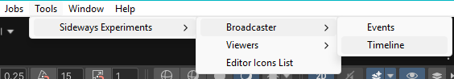
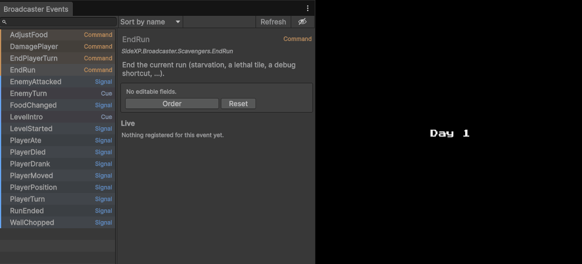
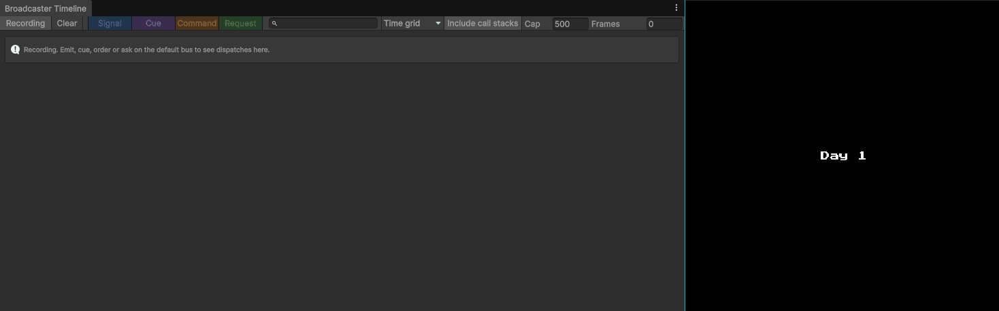

# Editor Windows

Broadcaster ships with two editor windows that make the bus observable: a **catalog** of every event in your project that can also fire events, and a **timeline** that records every dispatch as it happens. Both are pure consumers of the bus's internal monitor hooks.

Both windows live under the `Tools > Sideways Experiments > Broadcaster` menu.

## Events window

> `Tools > Sideways Experiments > Broadcaster > Events`

The Events window catalogs every event type in your project (anything implementing `ISignal`, `ICue`, `ICommand`, `ICommand<T>`, or `IRequest<T>`) and lets you draft and fire any of them without writing throwaway code. It works in **edit mode** as well as play mode.

### The catalog (left pane)

The left pane is a searchable tree of event types, nested by each event's display-name path (the `Name` you give in [`[Event(Name = "Combat/Damaged")]`](event-kinds.md#documenting-events-with-event) becomes a folder path). The toolbar above it holds:

- **Search field**: filter the tree by event name
- **Sort dropdown**: *Sort by name* (alphabetical) or *Sort by kind* (grouped by kind, then alphabetical).
- **Refresh**: rebuild the catalog. The catalog is rebuilt automatically after every recompile though.
- **Eye toggle**: reveal events marked `[Event(Hidden = true)]`, which are left out by default.

### Draft and fire (right pane)

Select an event to open its details: the display name, full type name, kind tag, and the `[Event]` description. Below that is the **emit box**:

- An editor for the event's public fields, so you can set the payload.
- A **fire button** labelled for the kind (**Emit** a signal, **Cue** a cue, **Order** a command, **Ask** a request). For a valued command or a request it also shows the result type (for example `Ask → Vector2Int`).
- A **Reset** button to restore the draft to defaults.
- An inline **result summary** after firing: the ack for a command, the returned value for a request, or live completion for a cue (it updates from *"in progress"* to *"performed"*, *"cancelled"*, or *"faulted"* as the performers finish).

An event type without a public parameterless constructor, or with no editable fields, is reported in place rather than drafted.

### Live status

The **Live** section at the bottom of the details pane shows what is currently registered for the selected event, but only in **play mode**. What it reports depends on the kind:

- **Signal**: the listener count, and whether a provider is alive.
- **Cue**: the performer count.
- **Command / Request**: the handler's owner, or *"no handler"*.

## Timeline window

> `Tools > Sideways Experiments > Broadcaster > Timeline`

The Timeline window is a profiler-style view of the dispatches the bus reported. Time runs left to right; each dispatch is a bar, the callbacks it invoked show as sub-segments, cascades link a parent dispatch to the ones it triggered, and violations mark where the bus was misused.

### Reading the timeline

- A **synchronous dispatch** (a signal emit, a sync order/ask) has near-zero duration and is drawn as a **point**.
- A **cue** or an **async order/ask** stretches into a **block** for as long as it runs, with a sub-segment per callback so a slow performer is visible.
- **Cascade edges**: link a dispatch to the dispatches it triggered (a listener that emits from inside its callback). For synchronous cascades the parent link is exact; across async continuations it is best-effort, so the windows may show temporal overlap without a hard edge.
- **Violations**: an unhandled command, a second handler, a synchronous call on an async handler (appear in the strip along the top, in place on the timeline).

### Toolbar controls

- **Recording / Paused**: toggle whether new dispatches are recorded.
- **Clear**: drop all recorded spans. The recorder otherwise keeps its history across play-mode transitions, so a session's timeline doesn't vanish when you stop.
- **Cap**: the maximum number of dispatches kept in memory; the oldest are dropped past this.
- **Frames**: keep only dispatches from the last N frames (`0` = unlimited), so a long session's timeline doesn't compress endlessly.
- **Include call stacks**: capture the C# call stack of each emit, shown in a selected span's *Emitter* section. This is costly and only affects dispatches recorded while it's on, so leave it off until you need to find *who* emitted something.
- **Search field**: filter by event type name.
- **Kind toggles**: show or hide Signals, Cues, Commands, and Requests independently.
- **Graduation dropdown**: rule the canvas by *Time grid* (elapsed time) or *Frame grid* (the frames dispatches occurred in).

### Inspecting a dispatch

Select a bar to open the detail pane below the canvas. It shows the event's payload snapshot, the callbacks it invoked with their outcomes, and (when call-stack capture was on) the emitter's stack. Each owner listed there has a **Ping** button to highlight it in the Hierarchy/Project and a **Filter** button to narrow the timeline to that owner. The active owner filter shows as a chip in the toolbar with an **✕** to clear it. A **Copy** button copies the span's details.

## When windows show nothing

Both windows read from the shared default bus (`Broadcaster.Default`), and re-point themselves at the current bus across play-mode transitions. If you route events through your own `EventBus` instance instead of the façade, these windows won't see them. That isolation is exactly why a private bus is useful in tests, but it means the tooling only observes traffic on the default bus.
