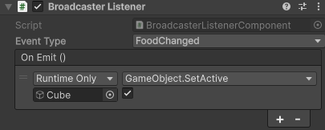

# Listener Component

This component allow you to listen for a [*Signal*](./event-kinds.md#signals) or a [*Cue*](./event-kinds.md#cues) and "convert" it into a parameterless `UnityEvent` so you can bind functions to it wwithout creating a new script.

**This should be used only for feedbacks.** You should avoid using events and bindings in the editor for your game logic.



## Adding it

Add the component to any GameObject:

> `Add Component > Sideways Experiments > Broadcaster > Broadcaster Listener`

It exposes two fields:

- **Event**: the signal or cue to react to, chosen from a picker (below).
- **On Emit**: a parameterless [`UnityEvent`](https://docs.unity3d.com/ScriptReference/Events.UnityEvent.html) invoked each time that event is sent. Wire it as you would any `UnityEvent`: drag a target object, pick a component method, set its arguments.

## Picking the event

The **Event** field is a dropdown. Clicking it opens a searchable picker of every signal and cue in your project, grouped under **Signals** and **Cues**, plus a **(None)** entry to clear the field:

- Type in the search box to filter by name.
- The button shows the selected event's display name once chosen, or **(Missing type)** if the referenced type no longer exists (for example, it was deleted).

The field stores the event's type, not a name string you could mistype, so a valid selection is always a real event.

## How it behaves

- **Signals**: the `On Emit` event is invoked every time the signal is [emitted](event-kinds.md#signals), synchronously, on the main thread.
- **Cues**: the component registers an **instant** [performer](event-kinds.md#cues). It runs the moment the cue is sent and completes immediately, so it never delays the cue's completion for the orchestrator awaiting it.

In both cases the reaction is **payload-agnostic**: `On Emit` takes no arguments, so it fires regardless of the event's fields. If you need the payload, write a script listener.

The component registers in `OnEnable` and unregisters in `OnDisable`, so disabling the component (or its GameObject) stops the reaction and re-enabling restores it. Registration uses the GameObject as its [owner](../core-concepts.md#owners-and-cleanup), so cleanup is automatic.

```csharp
// What the component does for you, in effect:
void OnEnable()  => Broadcaster.Subscribe<ScoreChanged>(this, _ => onFired.Invoke());
void OnDisable() => Broadcaster.UnregisterAll(this);
```