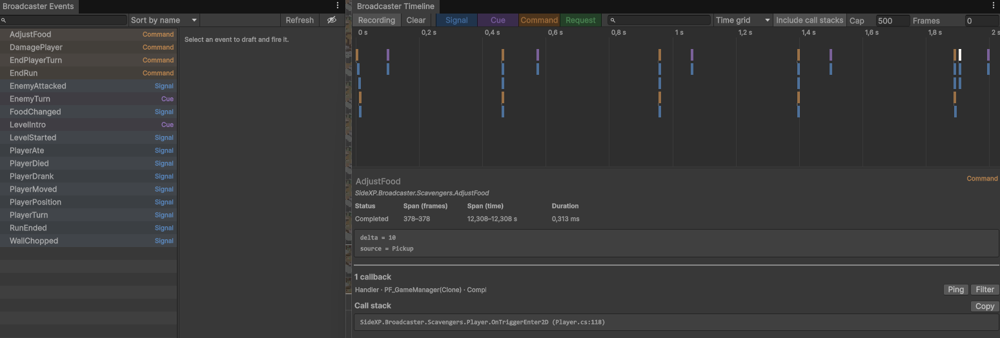

# SideXP - Broadcaster (Unity)

Code-first, type-keyed, intention-driven event bus for decoupled communication in *Unity* games and packages.

Events are very good for decoupling systems. You may be familiar with events (C# `event` keyword or [`UnityEvent`](https://docs.unity3d.com/Documentation/ScriptReference/Events.UnityEvent.html) for example). But at some point in a project, events can feel too limited and messy, making some behaviors blurry especially if you combine code and inspector listeners.

Broadcaster combines 2 approaches to make events usable for any kind of project, whether it's a prototype or a final production:

- **Events are type-keyed**, which means that instead of naming them using arbitrary strings or reaching a variable in a component, you just use their actual C# type, which is both their identity and payload.
- **Events are intention-driven**, which means that depending on the *nature* of an event (a notification, a question, an order, ...), you will use a specific kind of event but always through the same channel.

```csharp
using SideXP.Broadcaster;

// Declare an event by just creating a new class or struct
[Event("The score of the player has just changed.")]
public struct PlayerScoreChanged : ISignal { public int score; }

// Subscribe/unsubscribe to a typed signal
void OnEnable()  => Broadcaster.Subscribe<PlayerScoreChanged>(this, signal => scoreUI.text = signal.score.ToString());
void OnDisable() => Broadcaster.UnregisterAll(this);

// Emit a signal
Broadcaster.Emit(new PlayerScoreChanged { score = 1200 });
```

## Why use it

- **Four intentful event kinds**: *Signals* announce, *Commands* instruct, *Requests* ask, *Cues* coordinate timed reactions. The kind you choose is a contract, not just a channel.
- **Type-safe and code-first**: events are plain types, checked by the compiler. No string keys, no assets to wire up.
- **Decoupled by construction**: owner-based registration and one-line cleanup (`UnregisterAll(this)`): no dangling subscriptions, no references between systems.
- **First-class async**! Commands, Requests, and Cues can be awaited, with cancellation, and an in-flight await never hangs even if its handler goes away mid-flight.
- **Observable out of the box**: an Events catalog and a Timeline recorder window, at zero cost in a shipped build.
- **Testable in isolation**: a private `EventBus` per test: no scenes, no singletons, no teardown.



## Installation

### Option 1: Using the Package Manager

1. In your *Unity* project, go to `Window > Package Management > Package Manager` (or `Window > Package Manager` for *Unity 6.0-*)
2. Click on the *+* icon in the top-left corner, and select *Install package from Git URL...*
3. In the text field, enter the URL to this package's repository (including the `*.git` extensions), and click *Install*
4. Wait for Unity to get the files, and you're ready to go!

> Tip: if you need to use a specific version of this package for your project, add `#<tag-name>` to the URL before clicking on the *Install* button.

### Option 2: Extracting archive manually

1. Go to this project's `/releases` list
2. Download the ZIP file archive of your desired version
3. Extract the content of that archive into the `Packages/` folder of your Unity project
4. Wait for Unity to reload the solution, and you're ready to go!

> Tip: to avoid any path issue, make sure the folder that contains the package content has the same name as the `name` property defined in its `package.json` file.

## Documentation & Help

<!-- docs:remove:start -->
Complete documentation available at https://side-xp.github.io/unity-broadcaster

<!-- docs:remove:end -->
If you need help or just want to chat with the community and the *Sideways Experiments* core team, you're welcome to join our [Discord server](https://discord.gg/G49RUZ9F2N)!

## Contributing

<!-- docs:remove:start -->
Do you want to get involved in our projects? Check the [CONTRIBUTING.md](./CONTRIBUTING.md) file to learn more!
<!-- docs:remove:end -->
<!-- docs:only:start
Do you want to get involved in our projects? Check our [contributing guidelines](https://github.com/side-xp/unity-broadcaster/blob/main/CONTRIBUTING.md) to learn more!
docs:only:end -->

## License

<!-- docs:remove:start -->
This project is licensed under the [MIT License](./LICENSE.md).
<!-- docs:remove:end -->
<!-- docs:only:start
This project is licensed under the [MIT License](https://mit-license.org).
docs:only:end -->

---

Crafted and maintained with love by [Sideways Experiments](https://sideways-experiments.com)

(c) 2022-2026 Sideways Experiments